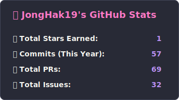

### 👋 안녕하세요, 성장을 즐기는 백엔드 개발자 [최종학]입니다.

- MSA와 DevOps 환경에서 안정적인 시스템을 구축하고 운영하는 데 큰 흥미를 가지고 있습니다.
- 복잡한 문제의 원인을 분석하고, 효율적인 해결책을 찾아 적용하는 과정을 즐깁니다.
- 학부 시절의 다양한 프로젝트 경험부터 최신 기술 스택을 활용한 실무 역량까지, 꾸준히 역량을 쌓아왔습니다.

---

### 🚀 기술 스택 (Tech Stack)

**Backend**

  
  
  

**Infra & DevOps**

  
  
  

**Database**

  
  

---

### 💻 주요 프로젝트 (Projects)

<b>🚀 (Main Project) 규팡 (Keupang) - MSA 기반 커머스 백엔드 & CI/CD 구축</b>

- **역할:** 백엔드 / 서버 배포
- **기간:** 2025.01 ~ 현재
- **기술 스택:** `Spring Boot`, `MSA`, `Java`, `MySQL`, `NCP`, `Jenkins`, `Docker`, `Docker-compose`
- **핵심 내용:** MSA 환경에서 Docker와 Jenkins를 활용해 커머스 백엔드 개발 및 CI/CD 파이프라인 자동화
- **주요 기여 및 성과:**
    - **MSA 인프라 설계 및 구축**: Eureka, Spring Cloud Gateway, Config Server를 도입하여 MSA의 기반을 직접 설계하고 구축했습니다.
    - **CI/CD 파이프라인 자동화**: Jenkins와 Docker Hub를 연동하여 **Git Push 시 빌드부터 배포까지의 전 과정을 자동화**하여 수동 배포 대비 시간을 획기적으로 단축했습니다.
    - **MSA 서비스 실행 순서 의존성 문제 해결**:
        - **문제**: `docker-compose up` 실행 시 Config Server가 준비되기 전에 다른 서비스가 실행되어 충돌하는 문제 발생.
        - **해결**: `depends_on`의 한계를 파악하고, **`restart_policy: on-failure`** 옵션을 적용하여 Config Server가 준비될 때까지 다른 서비스들이 자동으로 재시작되도록 구현하여 안정적인 서버 운영 환경을 마련했습니다.
    - **Docker Hub 기반 배포 프로세스 리팩토링**:
        - **문제**: Jar 파일과 Dockerfile을 서버로 직접 전송하는 비효율적인 배포 방식.
        - **해결**: `docker buildx`로 **멀티 플랫폼 이미지를 빌드**하여 Docker Hub에 Push하고, 서버에서는 이미지를 `pull` 받아 실행하도록 프로세스를 개선하여 **배포 과정을 대폭 간소화**했습니다.

<b>📈 (학부연구생) MES 시스템 유지보수 및 기능 개선</b>

- **역할:** 학부연구생 / 유지보수
- **기간:** 2023.05 ~ 2023.07
- **기술 스택:** `JSP`, `MySQL`, `Java`, `Servlet`
- **핵심 내용:** 기존 MES 시스템의 데이터 시각화, 페이지네이션, PDF 출력 기능 추가 개발
- **주요 기여 및 성과:**
    - **데이터 접근성 향상**: Google Charts API를 활용해 '발주 비용 현황' 대시보드를 개발하여 데이터 시각화를 구현했습니다.
    - **사용자 경험(UX) 개선**: 대용량 데이터 조회 페이지에 **페이지네이션(Pagination)** 기능을 적용하여 초기 로딩 속도를 개선하고 시스템 안정성을 높였습니다.
    - **업무 효율 증대**: PDF 영수증 출력 기능을 개발하여 수기 문서 작업을 자동화했습니다.

<b>🤖 (임베디드) 아이해피 - 음성인식 스마트 스피커 제작</b>

- **역할:** 하드웨어 개발 / 팀장
- **기간:** 2024.03 ~ 2024.06
- **기술 스택:** `Raspberry Pi`, `Python`, `3D printer`
- **핵심 내용:** 호출어 기반 음성 명령 인식 구조를 개선한 스마트 스피커 프로토타입 제작
- **주요 기여 및 성과:**
    - **호출어 기반 이벤트 트리 구조 설계**: "아이해피야"라는 호출어를 통해 질문 상태를 제어하는 구조를 설계하여 명령어 혼선 문제를 해결했습니다.
    - **음성 인식률 개선**: **정규표현식**을 활용하여 유사 발음에 대응함으로써 사용성을 높였습니다.
    - **임베디드 환경 경험**: SSH 원격 접속, Linux 명령어 등 임베디드 개발 환경에 대한 이해도를 확장했습니다.

<b>📱 (모바일 앱) 그 외 프로젝트</b>

- **냉장고 원격 제어 시스템** (2023.05 ~ 2023.06)
    - **역할:** 앱 개발 / 팀장
    - **기술 스택:** `Android(Java)`, `C/C++`
    - **기여:** 안드로이드와 Uno보드 간 **블루투스 통신**을 구현하고, 앱을 통해 원격으로 센서 정보를 확인하고 냉장고를 제어하는 기능을 개발했습니다.
- **멍멍리조트** (2023.04 ~ 2023.06)
    - **역할:** 백엔드 / ERD 설계 / 팀장
    - **기술 스택:** `Android(Java)`, `SQLite`
    - **기여:** 기존 DB 연동 방식의 어려움을 **SQLite 도입**으로 해결하여 팀 개발 효율을 높였으며, ERD 설계 및 입양 신청 CRUD 기능을 구현했습니다.
- **스터디 카페 좌석 관리 시스템** (2022.10 ~ 2022.12)
    - **역할:** 백엔드 / 팀장
    - **기술 스택:** `Java(Swing)`, `MySQL`
    - **기여:** **멀티스레드**를 활용하여 좌석별 이용 시간을 실시간으로 체크하는 후불 결제 기능을 구현했습니다.

---

### 📫 연락처 (Contact Me)

  
  
  

 

### 📈 GitHub 통계

